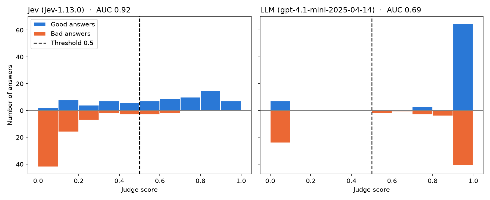

# JevJudge

Can **Jev** (a System One decision model) judge whether an answer is grounded in its evidence, and how does it compare with an LLM-as-a-judge?

This small experiment compares Jev, a fast, intuition-based model, with `gpt-4.1-mini`. The baseline is deliberately a small LLM: the task is a simple yes/no check, and a judge runs on every output it checks, so cost per call matters. For this job, a small, inexpensive LLM seems like the realistic alternative to Jev.

## Experiment

- **Task:** given `evidence`, `question` and `answer`, is the answer fully supported by the evidence?
- **Judges:** both implement `judge(evidence, question, answer) -> float in [0, 1]`.
  - **Jev:** the `Noul` primitive.
  - **LLM:** an Azure OpenAI deployment with structured output.
- **Data:** all 150 usable questions from the `test` split of the [RAGTruth](https://github.com/ParticleMedia/RAGTruth) QA task, 75 `pass` and 75 `fail`. An answer is `fail` if a human marked any span as hallucinated. It is one answer per question.

## Result

On 150 human-labelled RAG answers, Jev was the better judge: more accurate, faster and cheap.

| | Jev | LLM (gpt-4.1-mini) |
|---|--:|--:|
| Accuracy | **78.7%** (72.0 - 85.3) | 61.3% (53.3 - 69.3) |
| AUC | **0.92** (0.87 - 0.96) | 0.69 (0.61 - 0.75) |
| Good answers accepted | 64.0% | 90.7% |
| Bad answers rejected | 93.3% | 32.0% |
| Median latency | **0.24 s** | 0.63 s |
| Cost per 100 calls | **$0.0037** | $0.0259 |

95% bootstrap confidence intervals in brackets. Verdict is `pass` when score >= 0.5, for both judges. Source run: `results/2026-09-26_20-41-56/` (`jev-1.13.0`, one call per case, LLM at temperature 0).



How each judge scored the 75 good answers (above the axis) and the 75 bad answers (below it). A good judge pushes blue to the right and orange to the left. Jev does this, except for a tail of good answers under 0.5. The LLM puts most answers of both kinds at 0.9 to 1.0, so no threshold can separate them.

- **Jev beats this LLM baseline.** Compared case by case, Jev is ahead by 17 points (95% CI +7 to +28).
- **Jev's scores separate good from bad answers well** (AUC 0.92: a random good answer scores higher than a random bad one 92% of the time). The LLM's barely do: it gave most answers, good or bad, 0.9 or more.
- **At a 0.5 threshold Jev is strict.** Its scores run low: bad answers cluster under 0.2, but good ones spread across the whole range, so it rejected a third of the good answers. A Jev "pass" was right 48 times out of 53, while a "fail" is worth a second look, which means the threshold might need to be further tuned.
- **Jev is about 7x cheaper per call**, even though it reads more input tokens (870 vs 626 on average).

## Caveats

- **Small-model baseline only.** The LLM is asked for a score directly, with no reasoning step. A larger model or a reasoning step could do much better, at a higher cost per call.
- **Threshold not tuned.** 0.5 was fixed in advance. A lower threshold would likely suit Jev better, but it must be chosen on separate data, not these labels.
- **Narrow data.** Short web-search questions answered by 2023-era models, with span-level labels collapsed to pass/fail. RAGTruth is public and may be in either model's training data.
- **Single run.** Each case was judged once, so this does not test how stable the results are across repeated eval runs.

## Reproduce

Requires [uv](https://docs.astral.sh/uv/). Fill in the keys in `.env`, and adjust `pricing.toml` to your deployment.

```bash
uv sync
cp .env.sample .env
uv run python -m src.run_eval                        # both judges, all cases (--judge jev|llm, --limit N)
uv run python -m src.analyze                         # statistics + scores.png chart for every run in results/
uv run python scripts/fetch_ragtruth.py --force      # rebuild the dataset (optional)
```

## Attribution

RAGTruth: Niu et al., *RAGTruth: A Hallucination Corpus for Developing Trustworthy Retrieval-Augmented Language Models* (2024), MIT license.
